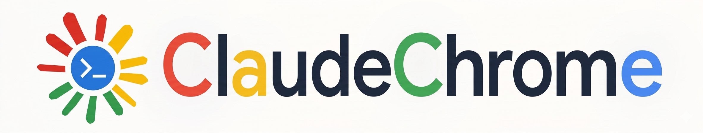

# ClaudeChrome

<p align="center">
  
</p>

ClaudeChrome is a browser-native extension built to bring agent intelligence directly into Chrome.

Today it already embeds Claude, Codex, and shell workflows directly into Chrome, and longer term it is intended to support more mainstream browsers as well. Its core value includes, but is not limited to, web debugging: ClaudeChrome keeps the agent attached to the live page so it can crawl sites, execute JavaScript, mimic native styles from existing websites, ingest content into knowledge systems, and sustain longer interactive workflows without forcing manual context transfer.

Switch to Chinese version: [README.md](README.md)

Landing page: [https://natsufox.github.io/ClaudeChrome/](https://natsufox.github.io/ClaudeChrome/)

Friend link: [LINUX DO](https://linux.do)

## 🎉 Latest updates

- **2026-04-15**
  - Published the first official `v0.1.0` release with two separate prebuilt downloads: one for the browser extension and one for the local native host.
  - Finalized the local deployment path so users can install, connect, and launch without rebuilding from source first.
  - Completed the remaining shortcut, working-directory validation, local-settings recovery, and exit-cleanup hardening needed for a real release.

- **2026-04-06**
  - Thanks to [@zuiyi233](https://github.com/zuiyi233) for using ClaudeChrome, sharing feedback, and contributing the PR. It resolved most Windows compatibility issues and added a bilingual Chinese/English UI.
  - Removed the old parameter settings button and added a configuration panel for centralized Agent CLI launch arguments, working directories, environment-info injection, and related options.

- **2026-04-05**
  - The open-source project is now public and ready for people to try. The README already includes installation and usage guides, and clearer docs and demo videos will continue to follow.

## 🎯 Near-term roadmap

- **Release 0.2.0**
  - [ ] Add multi-tab collaboration support, validate it in sign-up flow scenarios, and record a demo
  - [ ] Add interfaces for changing page elements and styles, strengthening the extension for page debugging, theme design, and similar workflows
  - [ ] Publish the release

- **Release 0.1.0**
  - [x] Build the landing page and demo videos, improve the open-source repo, and present the core features and use cases
  - [x] Fix Windows compatibility issues and make sure the main flows are usable
  - [x] Publish the release

## Demo gallery

GitHub README rendering does not reliably show inline `<video>` or `<iframe>` players here, so this gallery uses clickable GIF previews that open the bundled MP4 recordings.

**The `v0.1.0` release is now available, so people can download the prebuilt extension and native-host bundles directly instead of cloning and rebuilding first.**

<table>
  <tr>
    <td valign="top" width="50%">
      <strong>Demo 1 · 2048</strong><br>
      This demo focuses on the tool's capacity for continuous, complex interactions with visual elements in a gaming environment. It shows that ClaudeChrome can remain inside a long-running stateful loop instead of stopping at one-shot page reads.<br><br>
      <a href="assets/demo/readme_mp4/demo%202048_readme.mp4"></a><br>
      README MP4: <a href="assets/demo/readme_mp4/demo%202048_readme.mp4">demo 2048_readme.mp4</a><br>
      Quick view GIF: <a href="assets/demo/gif/demo%202048.gif">demo 2048.gif</a><br>
      HD promo MP4: <a href="assets/demo/promo_mp4/demo%202048_promo.mp4">demo 2048_promo.mp4</a>
    </td>
    <td valign="top" width="50%">
      <strong>Demo 2 · Amazon</strong><br>
      This demo primarily showcases ClaudeChrome's web crawling capabilities, including its interaction ability to handle page transitions and scrolling on a real commercial page.<br><br>
      <a href="assets/demo/readme_mp4/demo%20amazon_readme.mp4"></a><br>
      README MP4: <a href="assets/demo/readme_mp4/demo%20amazon_readme.mp4">demo amazon_readme.mp4</a><br>
      Quick view GIF: <a href="assets/demo/gif/demo%20amazon.gif">demo amazon.gif</a><br>
      HD promo MP4: <a href="assets/demo/promo_mp4/demo%20amazon_promo.mp4">demo amazon_promo.mp4</a>
    </td>
  </tr>
  <tr>
    <td valign="top" width="50%">
      <strong>Demo 3 · LINUX DO</strong><br>
      This demo is tailored for the LINUX DO forum. It illustrates how ClaudeChrome can crawl forum content and execute JavaScript commands according to user instructions while remaining grounded in the active thread.<br><br>
      <a href="assets/demo/readme_mp4/demo%20linuxdo_readme.mp4"></a><br>
      README MP4: <a href="assets/demo/readme_mp4/demo%20linuxdo_readme.mp4">demo linuxdo_readme.mp4</a><br>
      Quick view GIF: <a href="assets/demo/gif/demo%20linuxdo.gif">demo linuxdo.gif</a><br>
      HD promo MP4: <a href="assets/demo/promo_mp4/demo%20linuxdo_promo.mp4">demo linuxdo_promo.mp4</a>
    </td>
    <td valign="top" width="50%">
      <strong>Demo 4 · OpenClaw</strong><br>
      This demo highlights ClaudeChrome's browser extension capabilities. It can mimic existing websites to design similar styles natively, which is much more convenient and accurate than traditional methods like manually copying stylesheets.<br><br>
      <a href="assets/demo/readme_mp4/demo%20openclaw_readme.mp4"></a><br>
      README MP4: <a href="assets/demo/readme_mp4/demo%20openclaw_readme.mp4">demo openclaw_readme.mp4</a><br>
      Quick view GIF: <a href="assets/demo/gif/demo%20openclaw.gif">demo openclaw.gif</a><br>
      HD promo MP4: <a href="assets/demo/promo_mp4/demo%20openclaw_promo.mp4">demo openclaw_promo.mp4</a>
    </td>
  </tr>
  <tr>
    <td valign="top" width="50%">
      <strong>Demo 5 · Tapestry & Text Selection</strong><br>
      This demo focuses on integration with our earlier Tapestry project: it ingests page content directly into the knowledge base without calling Tapestry's built-in crawlers, and it also demonstrates actions driven by selected text on the page.<br><br>
      <a href="assets/demo/readme_mp4/demo%20tapestry%20%26%20texts%20selection_readme.mp4"></a><br>
      README MP4: <a href="assets/demo/readme_mp4/demo%20tapestry%20%26%20texts%20selection_readme.mp4">demo tapestry &amp; texts selection_readme.mp4</a><br>
      Quick view GIF: <a href="assets/demo/gif/demo%20tapestry%20%26%20texts%20selection.gif">demo tapestry &amp; texts selection.gif</a><br>
      HD promo MP4: <a href="assets/demo/promo_mp4/demo%20tapestry%20%26%20texts%20selection_promo.mp4">demo tapestry &amp; texts selection_promo.mp4</a>
    </td>
    <td valign="top" width="50%">
      <strong>Demo 6 · V2EX</strong><br>
      This second forum-focused demo complements the LINUX DO example. It shows ClaudeChrome crawling V2EX content and executing JavaScript commands on the page in response to user instructions.<br><br>
      <a href="assets/demo/readme_mp4/demo%20v2ex_readme.mp4"></a><br>
      README MP4: <a href="assets/demo/readme_mp4/demo%20v2ex_readme.mp4">demo v2ex_readme.mp4</a><br>
      Quick view GIF: <a href="assets/demo/gif/demo%20v2ex.gif">demo v2ex.gif</a><br>
      HD promo MP4: <a href="assets/demo/promo_mp4/demo%20v2ex_promo.mp4">demo v2ex_promo.mp4</a>
    </td>
  </tr>
</table>

## Installation and local usage

ClaudeChrome currently runs as two local pieces working together:

- a Chrome extension built into `dist/`
- a local Node.js host in `native-host/dist/main.js` that the side panel connects to over WebSocket

If you only want to run the project locally, follow the user-level guide first. If you plan to edit code, run tests, or work on the host/extension internals, use the developer-level guide below.

### 1. User-level guide

This path is for people who want a reliable local setup with the fewest moving parts.

#### Prerequisites

- Google Chrome with access to `chrome://extensions`
- a recent Node.js LTS release with `npm`

Notes:

- macOS and Linux already provide `bash` in normal setups.
- On Windows, install Git Bash or WSL and make sure `bash`, `claude`, and `codex` are all available globally on `PATH`.
- If you only want to verify the local bridge first, start with a Shell pane. That avoids depending on whether `claude` or `codex` is already installed.

#### Fastest path: use the two prebuilt GitHub release bundles

The `v0.1.0` release ships two separate downloads:

- `ClaudeChrome-extension-v0.1.0.zip`: after extraction, this is the unpacked extension directory you can load directly from `chrome://extensions`.
- `ClaudeChrome-native-host-v0.1.0.zip`: after extraction, this contains the already compiled native-host code, launch scripts, and the minimal `package.json` / `package-lock.json` needed to run it.

Recommended deployment order:

1. Download and extract both archives into your own local directories.
2. Inside the native-host bundle, run the OS-tagged launcher that matches your machine. On first run it installs the native-host runtime dependencies automatically if `node_modules/` is still missing.

macOS:

```bash
./start-native-host-macos.sh
```

Linux / Git Bash:

```bash
./start-native-host-linux.sh
```

Windows PowerShell:

```powershell
.\start-native-host-windows.ps1
```

Windows Command Prompt:

```bat
start-native-host-windows.cmd
```

3. If you prefer to install dependencies manually instead of using the bootstrap scripts, `npm install --omit=dev` inside the native-host bundle is still a valid fallback.
4. Open `chrome://extensions`, enable Developer mode, and use `Load unpacked` on the extracted extension bundle.
5. Open the ClaudeChrome side panel, keep the port at `9999`, click `Apply`, and wait for the connection status to turn healthy.
6. Create a `Shell` pane first to verify the bridge, then start `Claude` or `Codex` panes on machines where those CLIs are installed.

If you prefer to build from source instead of using the release bundles, continue with the source-build flow below.

#### Step 1: Install dependencies and build the local artifacts

```bash
cd ClaudeChrome

npm install
npm install --prefix native-host
npm run package
```

After that finishes, you should have:

- `dist/manifest.json` for the unpacked Chrome extension
- `native-host/dist/main.js` for the local host process

#### Step 2: Start the local host on a fixed port

The side panel defaults to `127.0.0.1:9999`, so using port `9999` avoids extra setup in the UI.

macOS / Linux / Git Bash:

```bash
CLAUDECHROME_WS_PORT=9999 npm --prefix native-host run start
```

PowerShell:

```powershell
$env:CLAUDECHROME_WS_PORT=9999
npm --prefix native-host run start
```

Leave that process running. On successful startup, the host should log events such as `ws_listening` and `ipc_listening`.

#### Step 3: Load the built extension into Chrome

1. Open `chrome://extensions`.
2. Turn on Developer mode.
3. Click Load unpacked.
4. Select the repo's `dist/` directory.
5. Pin or open the ClaudeChrome extension.

#### Step 4: Connect the side panel to the running host

1. Navigate Chrome to the page you want ClaudeChrome to inspect.
2. Open the ClaudeChrome side panel.
3. Confirm the `Port` field shows `9999`, or replace it with the port you used when starting the host.
4. Click `Apply`.
5. Wait for the status text to change from `Disconnected` to `Connected: ws://127.0.0.1:9999` or `Connected to ClaudeChrome host`.

#### Step 5: Launch your first pane

1. Keep the target browser tab active.
2. Click `+ Shell` first for a basic bridge check.
3. After Shell works, try `+ Claude` or `+ Codex` if those CLIs are installed.
4. New panes bind to the current active tab when the session is created.

At that point, ClaudeChrome is running locally and attached to the live tab you selected.

#### Optional: install the native-messaging manifest shipped by this repo

The WebSocket flow above is enough to run ClaudeChrome locally. If you also want to register the native-messaging manifest bundled in `native-host/src/install.ts`, run:

```bash
npm run install:host
```

That command writes `com.anthropic.claudechrome.json`, but it does not populate `allowed_origins`. You must add your unpacked extension ID manually.

Find your extension ID:

1. Open `chrome://extensions`.
2. Find ClaudeChrome.
3. Copy the extension ID shown on the extension card.

Manifest locations:

- macOS: `~/Library/Application Support/Google/Chrome/NativeMessagingHosts/com.anthropic.claudechrome.json`
- Linux: `~/.config/google-chrome/NativeMessagingHosts/com.anthropic.claudechrome.json`
- Windows: `%LOCALAPPDATA%\\Google\\Chrome\\User Data\\NativeMessagingHosts\\com.anthropic.claudechrome.json`

Edit the generated JSON file and set its `allowed_origins` field like this:

```json
"allowed_origins": [
  "chrome-extension://YOUR_EXTENSION_ID/"
]
```

Then click Reload on the ClaudeChrome extension in `chrome://extensions`. If the extension ID changes because you reload from a different unpacked path, update `allowed_origins` again.

#### First-run troubleshooting

- The side panel says `Cannot connect to ws://127.0.0.1:9999`: the host is not running, the host is on a different port, or you changed the port field without clicking `Apply`.
- You started the host without `CLAUDECHROME_WS_PORT=9999`: the native host defaults to a random port, so the panel will not find it unless you manually enter that port.
- `+ Shell` works but `+ Claude` or `+ Codex` fails: the corresponding CLI is missing from `PATH` inside a login shell.
- Pane launch fails immediately on Windows: `bash` is not available on `PATH`.
- `npm run package` fails inside `native-host`: rerun `npm install --prefix native-host`.
- `npm run test:live` cannot find a browser: set `CLAUDECHROME_LIVE_BROWSER=/absolute/path/to/chrome` and rerun the test.

### 2. Developer-level guide

Use this path if you will edit the extension, change the native host, or run the full validation loop.

#### Repo layout

- `extension/` contains the Chrome extension source
- `native-host/` contains the local host, session manager, and MCP bridge
- `dist/` is the built extension that Chrome loads via Load unpacked
- `scripts/` contains repo test harnesses, including live browser validation

#### One-time bootstrap

```bash
npm install
npm install --prefix native-host
npm run package
```

#### Recommended development loop

Terminal 1, watch the extension bundle:

```bash
npm run dev
```

Terminal 2, rebuild the native host when host-side code changes:

```bash
npm run build:host
```

If you want continuous rebuilds while editing `native-host/`, the existing TypeScript build script also supports watch mode:

```bash
npm --prefix native-host run build -- --watch
```

Terminal 3, run the host on the same port the side panel expects:

```bash
CLAUDECHROME_WS_PORT=9999 npm --prefix native-host run start
```

Chrome loop:

1. Load unpacked from `dist/`.
2. After `npm run dev` writes a new extension bundle, click Reload in `chrome://extensions`.
3. Keep the side panel port aligned with the host port.

#### Validation commands

Core scripted checks:

```bash
npm test
```

Live end-to-end check:

```bash
npm run test:live
```

`npm run test:live` launches an isolated host, loads the unpacked extension into a temporary Chrome/Chromium profile, connects the side panel, and exercises live browser features including:

- `browser__list_tabs`
- page text capture
- cookies and storage capture
- selector-based and coordinate-based clicking
- console capture

Useful live-test environment overrides:

- `CLAUDECHROME_LIVE_BROWSER=/absolute/path/to/chrome` to force a specific Chrome or Chromium binary
- on Linux without `DISPLAY`, install `xvfb-run` or provide a graphical session

#### Developer notes and invariants

- The side panel default is `127.0.0.1:9999`; the host defaults to a random port unless `CLAUDECHROME_WS_PORT` is set.
- `npm run install:host` registers a Chrome native-messaging manifest, but current repo-local development and `npm run test:live` work by launching the host directly and connecting the panel over WebSocket.
- `bash` is the launcher for Shell, Claude, and Codex panes. On platforms where `bash` is not already present, install it first.
- Claude panes invoke `claude --setting-sources user,project,local --mcp-config ...`; browser session semantics are exposed through the `claudechrome-browser` MCP tool rather than by stuffing page context into the launch prompt.
- Codex panes invoke `codex` with injected MCP server configuration for the ClaudeChrome browser bridge. The default launch options use `-a never -s workspace-write`, so sessions can write directly inside their workspace without silently expanding the default permission model to unrestricted full access.
- If `CLAUDECHROME_CWD` is not set explicitly, the host creates an isolated working directory for each session at `runtime/sessions/<sessionId>/workspace`, so new browser sessions do not drop into the ClaudeChrome repo root by default.
- On Windows, you can start the host directly with `scripts/start-windows.cmd` or `powershell -ExecutionPolicy Bypass -File scripts/start-windows.ps1`; those scripts reuse the same Git Bash detection logic as the runtime and automatically fill in missing install/build steps when needed.
- If you need multiple local host instances, isolate them with `CLAUDECHROME_WS_PORT`, `CLAUDECHROME_RUNTIME_DIR`, and related environment variables instead of sharing one runtime directory.

## What ClaudeChrome is for

ClaudeChrome is built for people who already work with browsers as part of their daily development, debugging, research, and verification flow.

It helps close the gap between two worlds that are usually disconnected:

- the browser, where the real product behavior happens
- the coding agent, where reasoning, debugging, and execution happen

The project exists to make that loop faster, more practical, and more reliable.

## Practical value

ClaudeChrome is designed to make browser-aware work feel direct instead of awkward.

With ClaudeChrome, you can:

- keep an agent next to the page you are inspecting instead of constantly context-switching
- work against the live tab you are actually viewing rather than describing it from memory
- move faster from “something looks wrong” to “here is the exact issue and next action”
- reduce manual copy-paste between the browser, terminal, and notes
- keep browser-assisted development local and close to your real workflow

The core promise is simple: the agent should understand the page you are working with, not a secondhand summary of it.

## What you can do with it

ClaudeChrome is meant to support practical, everyday browser work such as:

- debugging a broken UI while the agent stays attached to the exact tab in question
- reviewing what a page is showing before making code or content changes
- checking live page text, console behavior, and browser-side state while investigating issues
- keeping multiple task-focused panes open for different pages, environments, or workflows
- using the browser as part of the working environment rather than as a separate tool you have to describe manually

This makes the project especially useful when the browser is not just a place to view output, but part of the real runtime.

## Who it is for

ClaudeChrome is aimed at people who get real value from a browser-aware coding agent.

Typical users include:

- frontend engineers debugging real pages and flows
- full-stack developers tracing issues across UI and application behavior
- QA and product-minded builders who want faster investigation loops
- solo builders who live in the browser and want an assistant that stays close to the work
- researchers, tinkerers, and power users who want a more capable browser-side workflow

If your work often begins with “look at this tab” or “something on this page is wrong,” ClaudeChrome is built for you.

## Why it feels different

Most coding agents still treat the browser like a distant target. ClaudeChrome is built around the idea that the browser should be part of the working surface itself.

That changes the experience in a few important ways:

- the agent stays close to the live page instead of working from detached descriptions
- the browser becomes an active workspace, not just a thing you switch back to
- multiple panes and workspaces make it easier to separate tasks without losing context
- the overall workflow feels more like working beside the page than operating a remote tool

The result is a more grounded, more usable assistant for browser-heavy work.

## Example scenarios

### Debugging a product page

You are looking at a page that behaves incorrectly. Instead of explaining the issue from scratch, you keep the agent attached to that page and work through the problem while both of you are looking at the same thing.

### Verifying a flow before changing code

You want to confirm what a page currently does before editing anything. ClaudeChrome keeps the investigation tied to the live browser state so decisions are based on the actual product, not assumptions.

### Running parallel browser-aware tasks

You want one pane focused on a customer-facing page, another on an admin flow, and another on a general-purpose shell. ClaudeChrome makes that style of working feel natural rather than improvised.

## Project direction

ClaudeChrome is focused on one practical outcome: making local coding agents genuinely useful in browser-first workflows.

The project is not trying to be a generic browser extension with AI branding. It is trying to become a serious working surface for people who need their agent to stay connected to the page, the task, and the real runtime context.

## Status

ClaudeChrome is under active development and already demonstrates the core product direction clearly:

- a browser-side working surface for local agents
- session-aware page attachment
- practical browser-aware workflows
- a stronger loop between observation, reasoning, and action

The project is moving toward a more capable, more polished browser-native agent experience, but the central value proposition is already visible today.

## In one sentence

ClaudeChrome is for people who want their coding agent to work with the browser they are actually using, not around it.
